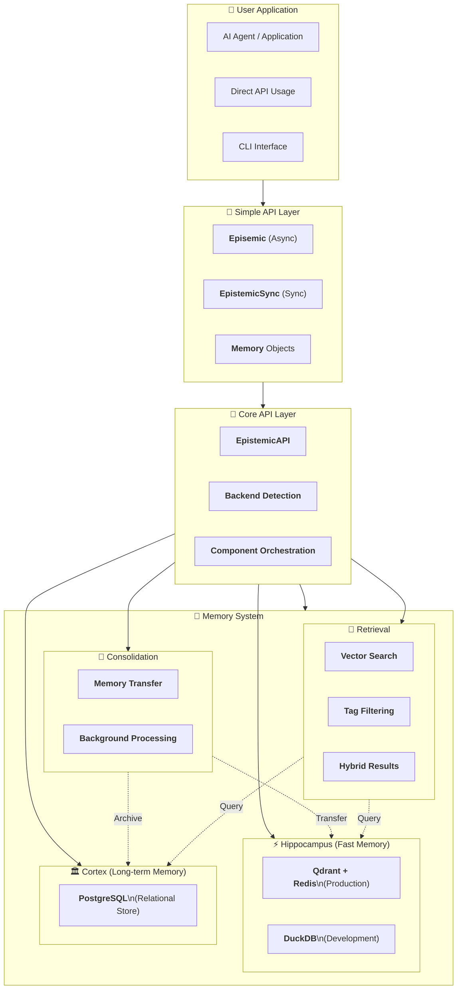
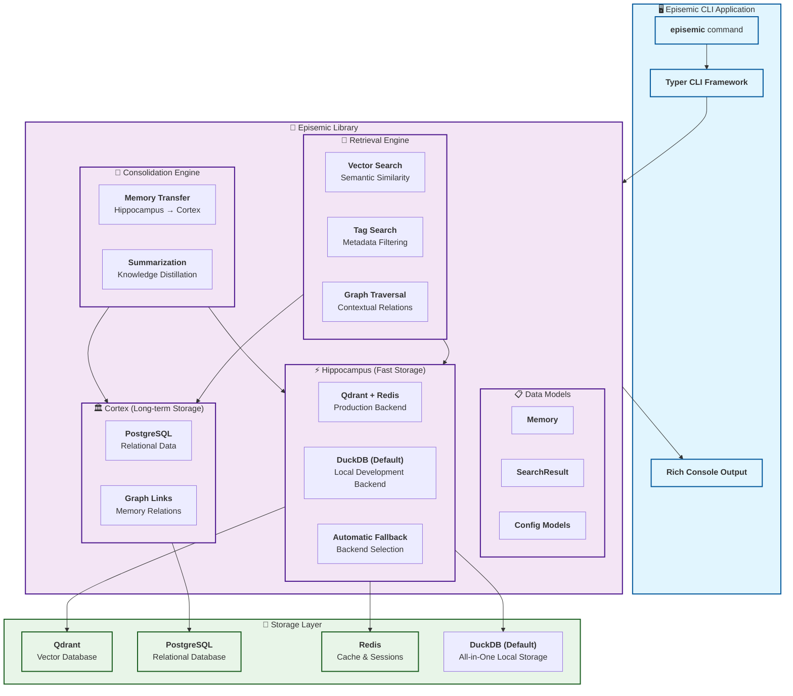

# Contributing to Episemic 🧠

Thank you for your interest in contributing to Episemic! This guide will help you set up your development environment and understand our development workflow.

## 🚀 Quick Development Setup

### Prerequisites

- Python 3.11 or higher
- Git
- Poetry (optional, but recommended)

### 1. Clone and Setup

```bash
# Clone the repository
git clone https://github.com/episemic/episemic.git
cd episemic

# Set up virtual environment and install dependencies
python -m venv .venv
source .venv/bin/activate  # On Windows: .venv\Scripts\activate

# Install with development dependencies
make dev

# Install pre-commit hooks
make pre-commit
```

### 2. Alternative Setup with Poetry

```bash
# If you prefer using Poetry directly
pip install poetry
poetry install --with dev
poetry run pre-commit install
```

## 🧪 Development Workflow

### Running Tests

```bash
# Run all tests
make test

# Run tests with coverage
pytest tests/ -v --cov=episemic

# Run specific test file
pytest tests/test_simple_api.py -v
```

### Code Quality

```bash
# Run linting
make lint

# Format code
make format

# Type checking
make type-check

# Run all quality checks
make check
```

### Development Storage Options

**Episemic** supports two storage modes for development:

#### 1. 🦆 DuckDB (Default - Recommended for Development)
- **No external dependencies** - works out of the box
- **Perfect for development** and testing
- **Local file storage** with in-memory fallback
- **Built-in vector search** using sentence transformers

```python
from episemic import Episemic

# Works immediately - no setup needed!
async with Episemic() as episemic:
    memory = await episemic.remember("Hello world!")
    results = await episemic.recall("world")
```

#### 2. ⚡ Qdrant + PostgreSQL (Production-like Setup)
If you want to test with production-like services:

```bash
# Start services with Docker
docker run -p 6333:6333 qdrant/qdrant
docker run -p 5432:5432 -e POSTGRES_PASSWORD=password postgres

# Configure environment
export QDRANT_HOST=localhost
export POSTGRES_HOST=localhost
export POSTGRES_PASSWORD=password
export EPISEMIC_PREFER_QDRANT=true
```

## 📁 Project Structure

```
episemic/
├── __init__.py              # Package initialization & simple API
├── simple.py                # User-friendly simple API
├── api.py                   # High-level internal API
├── config.py                # Configuration management
├── models.py                # Pydantic data models
├── hippocampus/            # Fast memory storage
│   ├── __init__.py
│   ├── hippocampus.py      # Qdrant + Redis implementation
│   └── duckdb_hippocampus.py # DuckDB fallback implementation
├── cortex/                 # Long-term memory (PostgreSQL)
│   ├── __init__.py
│   └── cortex.py
├── consolidation/          # Memory consolidation engine
│   ├── __init__.py
│   └── consolidation.py
├── retrieval/              # Multi-path retrieval system
│   ├── __init__.py
│   └── retrieval.py
└── cli/                    # Typer CLI interface
    ├── __init__.py
    └── main.py

tests/                      # Test suite
├── test_simple_api.py               # Simple API tests
├── test_simple_api_comprehensive.py # Comprehensive simple API tests
├── test_api_integration.py          # API integration tests
├── test_library_api.py              # Library API tests
├── test_duckdb_fallback.py          # DuckDB fallback tests
├── test_duckdb_comprehensive.py     # Comprehensive DuckDB tests
├── test_hippocampus_comprehensive.py # Hippocampus tests
├── test_cortex_comprehensive.py     # Cortex tests
├── test_consolidation_engine.py     # Consolidation engine tests
├── test_retrieval_engine.py         # Retrieval engine tests
├── test_cli_basic.py               # Basic CLI tests
├── test_cli_comprehensive.py       # Comprehensive CLI tests
├── test_config_comprehensive.py    # Configuration tests
├── test_models.py                  # Data model tests
└── ...

docs/                       # Generated documentation
├── index.html              # Documentation portal
└── api/                    # pydoc-generated docs

scripts/                    # Packaging and build scripts
├── build.sh               # Build package
├── upload-test.sh         # Upload to test PyPI
├── upload.sh              # Upload to production PyPI
└── package.sh             # Complete packaging workflow
```

## 🧩 System Architecture

### Episemic Memory Architecture


### CLI Application Architecture


## 🛠️ Available Make Commands

| Command | Description |
|---------|-------------|
| `make dev` | Install with development dependencies |
| `make install` | Install production dependencies only |
| `make test` | Run test suite |
| `make lint` | Run code linting |
| `make format` | Format code with ruff |
| `make type-check` | Run type checking with mypy |
| `make check` | Run all quality checks (lint + type + test) |
| `make clean` | Clean up cache files |
| `make pre-commit` | Install pre-commit hooks |
| `make run` | Run the CLI in development mode |
| `make build` | Build package with poetry |
| `make docs` | Generate API documentation |
| `make docs-view` | Open documentation in browser |

## 📦 Packaging Commands

| Command | Description |
|---------|-------------|
| `make package-build` | Build package for distribution |
| `make package-test` | Build and upload to test PyPI |
| `make package-prod` | Build and upload to production PyPI |

## 🔢 Version Management

| Command | Description |
|---------|-------------|
| `make version` | Show current version |
| `make bump-patch` | Bump patch version (1.0.2 → 1.0.3) |
| `make bump-minor` | Bump minor version (1.0.2 → 1.1.0) |
| `make bump-major` | Bump major version (1.0.2 → 2.0.0) |
| `make release-patch` | Bump patch version and upload to test PyPI |
| `make release-minor` | Bump minor version and upload to test PyPI |
| `make release-major` | Bump major version and upload to test PyPI |

See [VERSIONING.md](VERSIONING.md) for detailed version management documentation.

## 🧪 Testing Guidelines

### Test Structure
- Unit tests for individual modules
- Integration tests for API workflows
- Both DuckDB and Qdrant storage tests

### Running Specific Tests
```bash
# Test simple API
pytest tests/test_simple_api.py -v

# Test DuckDB fallback
pytest tests/test_duckdb_fallback.py -v

# Test with specific storage backend
EPISEMIC_PREFER_QDRANT=false pytest tests/ -v  # DuckDB only
EPISEMIC_PREFER_QDRANT=true pytest tests/ -v   # Qdrant if available
```

### Writing Tests
- Use `pytest` fixtures for setup/teardown
- Test both async and sync APIs
- Include edge cases and error conditions
- Use `pytest-asyncio` for async tests

## 🔧 Configuration for Development

### Environment Variables
```bash
# DuckDB configuration (default)
export DUCKDB_PATH="/tmp/test_memories.db"
export DUCKDB_MODEL="all-MiniLM-L6-v2"

# Qdrant configuration (optional)
export QDRANT_HOST="localhost"
export QDRANT_PORT="6333"
export EPISEMIC_PREFER_QDRANT="false"  # Use DuckDB by default

# PostgreSQL configuration (optional)
export POSTGRES_HOST="localhost"
export POSTGRES_DB="episemic_test"
export POSTGRES_USER="postgres"
export POSTGRES_PASSWORD="password"

# Debug settings
export EPISEMIC_DEBUG="true"
```

## 📋 Code Style Guidelines

- **Python 3.11+** syntax and features
- **Type hints** for all public APIs
- **Docstrings** for all modules, classes, and functions
- **Async/await** for I/O operations
- **Pydantic models** for data validation
- **Rich** for CLI output formatting

### Pre-commit Hooks
We use pre-commit hooks to ensure code quality:
- **ruff** for linting and formatting
- **mypy** for type checking
- **pytest** for running tests

## 🤝 Contributing Workflow

1. **Fork** the repository
2. **Create** a feature branch (`git checkout -b feature/amazing-feature`)
3. **Make** your changes with tests
4. **Run** quality checks (`make check`)
5. **Commit** your changes (`git commit -m 'Add amazing feature'`)
6. **Push** to your branch (`git push origin feature/amazing-feature`)
7. **Open** a Pull Request

## 📝 Documentation

- **API documentation** is auto-generated with `make docs`
- **Examples** are in the `examples/` directory
- **README** focuses on user installation and basic usage
- **CONTRIBUTING** (this file) covers development setup

## 🐛 Issues and Bug Reports

When reporting issues:
1. Include Python version and OS
2. Provide steps to reproduce
3. Include error messages and stack traces
4. Mention which storage backend you're using

## 📄 License

This project is licensed under the MIT License - see the [LICENSE](LICENSE) file for details.

## 🙏 Thanks

Thank you for contributing to Episemic! Your contributions help make AI memory systems more accessible and powerful.