# Episemic Core 🧠

**Episemic Core** is the heart of the **Episemic** AI memory system — a brain-inspired platform that enables AI agents to **encode, store, consolidate, and retrieve memory** in a way similar to human cognition. Episemic combines **episodic and semantic memory**, **replay-based consolidation**, and **associative retrieval** to create intelligent, context-aware agents.

---

## 🚀 Features

- **Brain-Inspired Memory Architecture**
  - Episodic Memory (Hippocampus-like): High-fidelity experiences
  - Semantic Memory (Cortex-like): Consolidated, structured knowledge
- **Replay & Consolidation**
  - Prioritized experience sampling
  - Distillation from episodic → semantic memory
- **Associative Retrieval**
  - Pattern completion
  - kNN-based search across memory stores
  - Context merging for AI agent reasoning
- **Modular & Extensible**
  - Supports multiple AI agents and environments
  - Easily extendable with new memory modules or adapters

---

## 🧩 System Architecture

### Core Memory System


### CLI Application Architecture

```mermaid
graph TB
    subgraph CLI["🖥️ Episemic CLI Application"]
        CMD["`**episemic** command`"]
        TYPER["`**Typer CLI Framework**`"]
        RICH["`**Rich Console Output**`"]
    end

    subgraph Core["🧠 Episemic Core Library"]
        subgraph Models["📋 Data Models"]
            M1["`**Memory**`"]
            M2["`**SearchQuery**`"]
            M3["`**SearchResult**`"]
        end

        subgraph Hippocampus["⚡ Hippocampus (Fast Storage)"]
            H1["`**Qdrant Client**
            Vector Storage`"]
            H2["`**Redis Cache**
            Session Storage`"]
        end

        subgraph Cortex["🏛️ Cortex (Long-term Storage)"]
            C1["`**PostgreSQL**
            Relational Data`"]
            C2["`**Graph Links**
            Memory Relations`"]
        end

        subgraph Consolidation["🔄 Consolidation Engine"]
            CON1["`**Memory Transfer**
            Hippocampus → Cortex`"]
            CON2["`**Summarization**
            Knowledge Distillation`"]
        end

        subgraph Retrieval["🎯 Retrieval Engine"]
            R1["`**Vector Search**
            Semantic Similarity`"]
            R2["`**Tag Search**
            Metadata Filtering`"]
            R3["`**Graph Traversal**
            Contextual Relations`"]
        end
    end

    subgraph Storage["💾 Storage Layer"]
        QDRANT["`**Qdrant**
        Vector Database`"]
        POSTGRES["`**PostgreSQL**
        Relational Database`"]
        REDIS["`**Redis**
        Cache & Sessions`"]
    end

    CMD --> TYPER
    TYPER --> Core
    Core --> RICH

    Hippocampus --> QDRANT
    Hippocampus --> REDIS
    Cortex --> POSTGRES

    Consolidation --> Hippocampus
    Consolidation --> Cortex

    Retrieval --> Hippocampus
    Retrieval --> Cortex

    classDef cli fill:#e1f5fe,stroke:#01579b,stroke-width:2px
    classDef core fill:#f3e5f5,stroke:#4a148c,stroke-width:2px
    classDef storage fill:#e8f5e8,stroke:#1b5e20,stroke-width:2px

    class CLI,CMD,TYPER,RICH cli
    class Core,Models,Hippocampus,Cortex,Consolidation,Retrieval core
    class Storage,QDRANT,POSTGRES,REDIS storage
```


---

## 🚀 Quick Start

### Installation

```bash
# Clone the repository
git clone <repository-url>
cd episemic

# Set up virtual environment and install dependencies
python -m venv .venv
source .venv/bin/activate  # On Windows: .venv\Scripts\activate
pip install poetry
poetry install
```

### CLI Usage

```bash
# Initialize the memory system
episemic init

# Store a new memory
episemic store "This is my first memory" --title "First Memory" --tags ai memory

# Search for memories
episemic search "memory" --top-k 5 --tags ai

# Retrieve a specific memory
episemic get <memory-id>

# Run memory consolidation
episemic consolidate --auto

# Check system health
episemic health

# Show version
episemic version
```

### Library Usage

Episemic can also be used as a Python library with an incredibly simple API:

```python
import asyncio
from episemic_core import Episemic

async def main():
    # Initialize the memory system
    async with Episemic() as episemic:
        # Store a memory
        memory = await episemic.remember(
            "Machine learning models need training data",
            title="ML Requirements",
            tags=["ml", "training"]
        )

        # Search for memories
        results = await episemic.recall("training data")

        # Get a specific memory
        retrieved = await episemic.get(memory.id)

        print(f"Stored: {memory.title}")
        print(f"Found {len(results)} related memories")

asyncio.run(main())
```

**For non-async code, use the sync version:**

```python
from episemic_core import EpistemicSync

episemic = EpistemicSync()
episemic.start()

# Store memories
memory = episemic.remember("Important information", tags=["work"])

# Search memories
results = episemic.recall("important")

print(f"Found {len(results)} memories")
```

**Key Features:**
- 🎯 **Simple API** - Just `remember()` and `recall()` - that's it!
- ⚡ **Smart Storage** - Automatically optimizes for fast retrieval and long-term storage
- 🔍 **Intelligent Search** - Uses vector similarity, tags, and graph relationships
- 🔧 **Easy Configuration** - Pass database settings as simple parameters
- 🚀 **Async & Sync** - Works in both async and traditional Python code
- 📊 **Rich Metadata** - Store additional data with any memory

See [`examples/simple_usage.py`](examples/simple_usage.py) for more examples.

### Available Commands

| Command | Description | Example |
|---------|-------------|---------|
| `init` | Initialize the Episemic memory system | `episemic init --qdrant-host localhost` |
| `store` | Store a new memory | `episemic store "Text content" --title "Title" --tags tag1 tag2` |
| `search` | Search for memories | `episemic search "query" --top-k 10 --tags ai` |
| `get` | Retrieve memory by ID | `episemic get abc123...` |
| `consolidate` | Run memory consolidation | `episemic consolidate --auto` |
| `health` | Check system health | `episemic health` |
| `version` | Show version info | `episemic version` |

---

## 🛠️ Development

### Setup Development Environment

```bash
# Install with development dependencies
make dev

# Install pre-commit hooks
make pre-commit

# Run tests
make test

# Run linting
make lint

# Format code
make format

# Type checking
make type-check

# Run all checks
make check
```

### Project Structure

```
episemic_core/
├── __init__.py              # Package initialization
├── models.py                # Pydantic data models
├── hippocampus/            # Fast memory storage (Qdrant + Redis)
│   ├── __init__.py
│   └── hippocampus.py
├── cortex/                 # Long-term memory (PostgreSQL)
│   ├── __init__.py
│   └── cortex.py
├── consolidation/          # Memory consolidation engine
│   ├── __init__.py
│   └── consolidation.py
├── retrieval/              # Multi-path retrieval system
│   ├── __init__.py
│   └── retrieval.py
└── cli/                    # Typer CLI interface
    ├── __init__.py
    └── main.py
```
